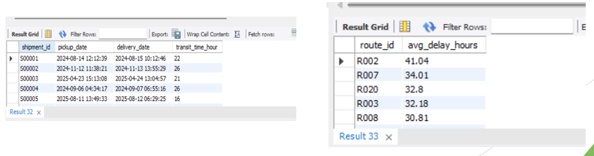
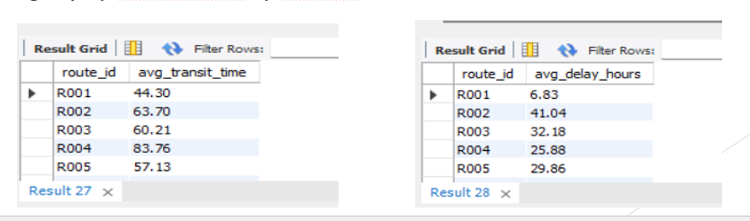
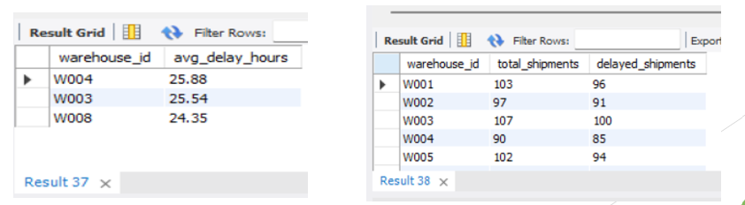
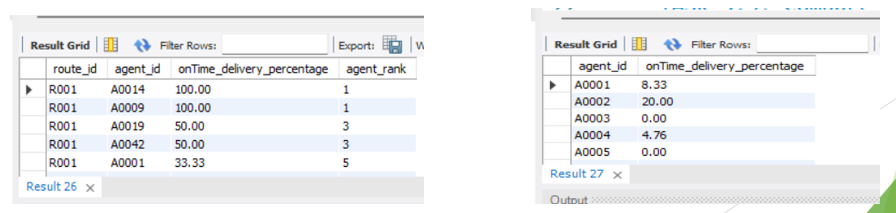
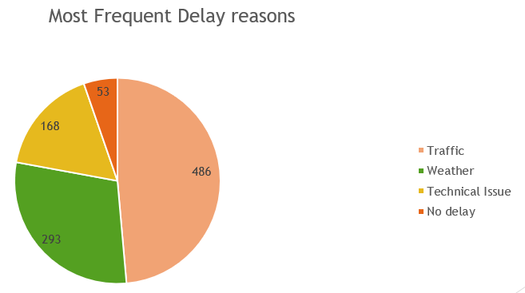

# 🚚 Logistics Optimization for Delivery Routes – DHL  
### SQL-Based Logistics Performance Analytics

📍 Data Analytics Project | SQL | KPI Reporting | Operational Insights  

---

## 📌 Project Overview

This project analyzes DHL’s logistics network to identify delivery delays, optimize route efficiency, evaluate warehouse performance, and assess delivery agent effectiveness using SQL-driven analytics.

The goal: **Improve operational efficiency and reduce delivery delays through data-driven insights.**

---

## 📊 Key Analysis Areas

✔ Delivery Delay Analysis  
✔ Route Efficiency Optimization  
✔ Warehouse Performance Evaluation  
✔ Delivery Agent Ranking  
✔ Shipment Tracking & KPI Reporting  

---

## 📈 Major Insights

- Identified top delayed routes impacting delivery timelines.
- Detected low efficiency routes using distance-to-time ratio.
- Highlighted warehouses with above-average delays.
- Ranked agents based on on-time delivery performance.
- Found Traffic & Weather as primary delay causes.
- Measured warehouse utilization (3%–10% capacity usage).

---

## 📷 Dashboard & Visual Insights

### 🚦 Top Delayed Routes

### ⏱ Average Transit Time

### 🏭 Warehouse Performance

### 👥 Delivery Agent Rankings

### 🚨 Delay Reasons

---

## 🚀 Business Recommendations

- Prioritize optimization of low-efficiency routes.
- Improve warehouse scheduling & capacity planning.
- Provide training for low-performing agents.
- Monitor high-delay routes proactively.
- Use KPI dashboards for continuous performance tracking.

---

## 🛠 Tools Used

- MySQL
- Advanced SQL
- Window Functions
- CTEs
- Aggregation & Grouping
- KPI Reporting

---

## 🎯 Business Impact

This project demonstrates how structured SQL analytics can:

- Reduce operational bottlenecks  
- Improve delivery efficiency  
- Optimize resource allocation  
- Enable data-driven logistics decisions  

## Repository Structure
DHL-project/
│
├── SQL files
├── dataset
├── screenshots/
└── README.md

